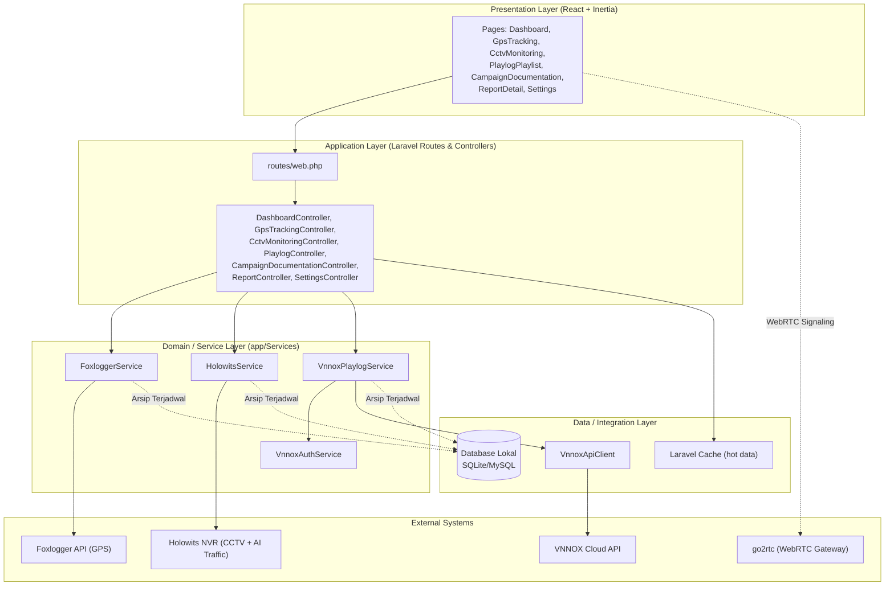

# Arsitektur Aplikasi LED-FLX Fleet Control System (Layered Architecture)

Dokumen ini mendokumentasikan pola **Layered Architecture (Arsitektur Multi-Lapis)** yang diterapkan pada platform **LED-FLX Fleet Control System** untuk memantau dan mengendalikan armada truk LED advertising: **GPS tracking**, **live CCTV & AI Traffic**, **playlist/playlog videotron (VNNOX / Novastar)**, **dokumentasi kampanye**, serta **pelaporan komprehensif**.

> Dokumen ini telah disesuaikan dengan struktur kode aktual: **Laravel 12 (Backend)** + **React 19 + Inertia.js 3 (Frontend)**.

---

## 1. Ikhtisar Arsitektur Lapis (Layered Architecture)



---

## 2. Stack Teknologi

| Lapisan   | Teknologi                                                                                           |
| --------- | --------------------------------------------------------------------------------------------------- |
| Backend   | PHP ^8.2, Laravel 12, Inertia Laravel, barryvdh/laravel-dompdf (PDF)                                |
| Frontend  | React 19, Inertia.js 3, Tailwind CSS 4, Vite 7, Leaflet/react-leaflet (peta), lucide-react, mqtt.js |
| Streaming | go2rtc sebagai WebRTC gateway untuk feed RTSP NVR (`tools/streaming/go2rtc.yaml.example`)           |
| Database  | Eloquent ORM (SQLite/MySQL) + Laravel Cache untuk data panas (hot data)                             |

---

## 3. Detail Pembagian Lapisan (Layer Breakdown)

### 💻 1. Presentation Layer (Frontend - React + Inertia.js)

Lokasi: `resources/js/`

- **Layouts**: `AppLayout.jsx` (kerangka aplikasi), `Navbar.jsx`, `Sidebar.jsx`.
- **Pages (`resources/js/Pages/`)**:
    - `Login.jsx`: Autentikasi pengguna.
    - `Dashboard.jsx`: Executive overview (GPS live, Novastar, CCTV) dengan render instan dari cache.
    - `GpsTracking.jsx`: Peta live tracking armada (Leaflet) + riwayat & ekspor.
    - `CctvMonitoring.jsx`: Live CCTV (WebRTC) + kartu statistik AI Traffic.
    - `PlaylogPlaylist.jsx`: Antrean playlist LED, status controller Novastar, histori playlog.
    - `CampaignDocumentation.jsx`: Galeri dokumentasi kampanye per folder (difilter per klien).
    - `ReportDetail.jsx`: Laporan multi-tab (Overview, Traffic AI, Playlog, GPS).
    - `Settings.jsx`: Pengaturan global (khusus Admin).
- **Components**:
    - `WebRtcPlayer.jsx`: Player stream WebRTC via go2rtc.
    - `DownloadProgressBar.jsx`, `DashboardSkeleton.jsx`: UX loading/unduhan.
    - `Playlog/PlaylistGrid.jsx`, `Playlog/NovastarControllerCard.jsx`, `Playlog/PlaylogBannerHeader.jsx`, `Playlog/PlaylogRecordsTable.jsx`: Komponen halaman Playlog.

---

### ⚙️ 2. Application Layer (Backend Controllers & Routing)

Lokasi: `app/Http/Controllers/` & `routes/web.php`

Menerima request HTTP, memvalidasi input, lalu mengembalikan respon Inertia (halaman) atau JSON (API polling).

| Controller                                | Tanggung Jawab Utama                                                                                             |
| ----------------------------------------- | ---------------------------------------------------------------------------------------------------------------- |
| `Auth/AuthenticatedSessionController.php` | Login/logout (route guest & auth)                                                                                |
| `DashboardController.php`                 | Render instan dari cache; API async `/api/dashboard/gps`, `/api/dashboard/novastar`, `/api/dashboard/traffic`    |
| `GpsTrackingController.php`               | Live sync posisi, riwayat per IMEI, ekspor Excel/PDF, refresh token Foxlogger (admin)                            |
| `CctvMonitoringController.php`            | Stream data NVR, stream per truk, traffic dari DB lokal, snapshot, PTZ, signaling WebRTC, pengaturan NVR (admin) |
| `PlaylogController.php`                   | Halaman playlog, live data VNNOX, ekspor CSV, trigger ganti materi & tambah material (admin)                     |
| `CampaignDocumentationController.php`     | Galeri dokumentasi; CRUD dokumen & folder (admin)                                                                |
| `ReportController.php`                    | Laporan detail multi-tab + ekspor PDF/Excel                                                                      |
| `SettingsController.php`                  | Pengaturan NVR/Foxlogger/VNNOX + manajemen akun user dengan masa berlaku (admin)                                 |

**Middleware**:

- `EnsureUserIsAdmin.php`: Memagari route tulis/admin (ganti materi, upload dokumentasi, settings, manajemen user).
- `HandleInertiaRequests.php`: Jembatan properti bersama Inertia.

---

### 🧠 3. Domain / Service Layer (Business Logic)

Lokasi: `app/Services/`

- **`FoxloggerService.php`** (GPS):
    - Autentikasi JWT untuk 2 akun (`truck_1` & `truck_2`) via Basic Auth ke `api-auth.foxlogger.app`.
    - Manajemen sesi: access_token + refresh_token di-cache 23 jam, fallback re-login otomatis.
    - Mengambil daftar perangkat, posisi terkini (`getReportPosition`), dan riwayat GPS per IMEI/tanggal.
- **`HolowitsService.php`** (CCTV & AI Traffic):
    - Integrasi NVR Holowits: status kamera/truk, snapshot, kontrol PTZ, statistik deteksi AI (motor, mobil, pejalan kaki, bus/truk).
    - Menyimpan status gabungan ke cache `holowits_truck_statuses`.
- **`Services/Vnnox/VnnoxAuthService.php`**:
    - Autentikasi stateless VNNOX: generate `Nonce`, `CurTime`, dan `CheckSum = SHA256(AppSecret + Nonce + CurTime)` murni di backend.
- **`Services/Vnnox/VnnoxApiClient.php`**:
    - Wrapper HTTP ke VNNOX Cloud API dengan **Rate Limiting Guard** dan retry/backoff; menyuntikkan header publik (`AppKey`, `Nonce`, `CurTime`, `CheckSum`) otomatis.
- **`Services/Vnnox/VnnoxPlaylogService.php`**:
    - Orkestrasi data playlist, status controller Novastar, dan rekaman playlog per truk (`truck_1`/`truck_2`) dengan cache lokal (`vnnox_playlist_data_*`, `vnnox_controller_status_*`, `vnnox_playlog_records_*`).
- **`ImageOptimizerService.php`**:
    - Kompresi/optimasi gambar hasil upload dokumentasi kampanye.

---

### 🔌 4. Data / Integration Layer (Persistence)

Lokasi: `app/Models/` & `database/migrations/`

| Model                                              | Tabel                                     | Fungsi                                                                      |
| -------------------------------------------------- | ----------------------------------------- | --------------------------------------------------------------------------- |
| `User.php`                                         | users (+ kolom role & expires_at)         | Akun admin/klien dengan masa berlaku                                        |
| `SystemSetting.php`                                | system_settings                           | Konfigurasi runtime (kredensial Foxlogger/VNNOX, IP NVR) tanpa deploy ulang |
| `GpsTelemetryLog.php`                              | gps_telemetry_logs                        | Arsip titik GPS historis (bulk sync dari Foxlogger)                         |
| `AiTrafficDailyLog.php`                            | ai_traffic_daily_logs                     | Arsip harian statistik AI Traffic NVR + estimasi reach                      |
| `VnnoxPlaylogLog.php`                              | vnnox_playlog_logs                        | Arsip rekaman tayang VNNOX per truk/hari                                    |
| `CampaignDocumentation.php` / `CampaignFolder.php` | campaign_documentations, campaign_folders | Dokumentasi kampanye & folder pengelompokan                                 |

Selain database, **Laravel Cache** dipakai sebagai lapisan data panas (sesi token, status perangkat, playlist) agar render halaman instan dan kuota API eksternal terlindungi.

---

## 4. Background Jobs & Scheduler (routes/console.php)

Pola utama: **API Eksternal → Scheduler tarik data → Arsip ke DB lokal → UI membaca dari DB/Cache**.

| Perintah                                                   | Jadwal (Asia/Jakarta)            | Fungsi                                                                           |
| ---------------------------------------------------------- | -------------------------------- | -------------------------------------------------------------------------------- |
| `gps:sync-daily --days=2` (`SyncDailyGpsLogs.php`)         | Tiap menit, `withoutOverlapping` | Arsip telemetri GPS hari ini & kemarin → `gps_telemetry_logs`                    |
| `traffic:sync-daily` (`SyncDailyAiTraffic.php`)            | Tiap jam + pukul 23:55           | Sinkron & arsip statistik AI Traffic NVR → `ai_traffic_daily_logs`               |
| `vnnox:sync-daily` (`SyncDailyVnnoxPlaylogs.php`)          | Tiap jam + pukul 23:50           | Arsip rekaman playlog Truk 1 & 2 → `vnnox_playlog_logs`                          |
| `foxlogger:mqtt-listen` (`FoxloggerMqttListenCommand.php`) | Proses daemon terpisah           | Listener MQTT real-time (dibungkus script Node `bin/foxlogger-mqtt-listener.js`) |

---

## 5. Integrasi Sistem Eksternal

| Sistem                                   | Peran                                                   | Jembatan                                         |
| ---------------------------------------- | ------------------------------------------------------- | ------------------------------------------------ |
| Foxlogger API (`api-v2.foxlogger.app`)   | Pelacakan GPS armada                                    | `FoxloggerService.php`                           |
| Holowits NVR                             | Feed CCTV + statistik deteksi AI                        | `HolowitsService.php`                            |
| VNNOX Cloud API (`openapi-eu.vnnox.com`) | Kontrol playlist LED, playlog, status Novastar          | `VnnoxApiClient.php` + `VnnoxAuthService.php`    |
| go2rtc                                   | Gateway WebRTC untuk menampilkan stream RTSP di browser | `WebRtcPlayer.jsx` + endpoint `/api/cctv/webrtc` |

---

## 6. Data Flow (Alur Kerja Utama)

### a. GPS Tracking

```
[Scheduler tiap menit] ──► [SyncDailyGpsLogs] ──► [FoxloggerService]
                                                          │
                                                          ▼
                                                 [Foxlogger API]
                                                          │
                                                          ▼
                                              [gps_telemetry_logs (DB)]
                                                          │
[GpsTracking.jsx / Leaflet] ◄──(JSON /api/gps-live-sync)──┘
```

### b. CCTV & AI Traffic

```
[CctvMonitoring.jsx] ──(WebRTC)──► [go2rtc] ──RTSP──► [Holowits NVR]
        │
        ├──(GET /api/cctv/stream-data)──► [HolowitsService] ──► [NVR API]
        │
        └──(GET /api/cctv/traffic-db)──► [ai_traffic_daily_logs (DB lokal)]
                                              ▲
[Scheduler hourly + 23:55] ─► [SyncDailyAiTraffic] ┘
```

### c. Playlist & Playlog VNNOX (Aksi "Tayangkan" oleh Admin)

```
[Admin klik "Tayangkan"] ──(POST /api/vnnox/play)──► [PlaylogController]
                                                             │
                                                             ▼
                                                   [VnnoxPlaylogService]
                                                             │
                                                             ▼
                                                    [VnnoxAuthService]
                                                    (SHA256 CheckSum)
                                                             │
                                                             ▼
                                                     [VnnoxApiClient]
                                                  (Header + Rate Limit)
                                                             │
                                                             ▼
                                                     [VNNOX Cloud API]
                                                             │
[UI update badge PLAYING] ◄────────(JSON Response)───────────┘
```

Histori tayangan diarsipkan otomatis oleh `vnnox:sync-daily` ke `vnnox_playlog_logs`.

### d. Pelaporan

```
[ReportDetail.jsx] ──► [ReportController] ──► Agregasi DB lokal
      │                                        (GPS + Traffic + Playlog)
      └──(GET /api/report/export-pdf|excel)──► [dompdf / Excel Export]
```

---

## 7. Keunggulan Struktur Layered Ini

1. **Separation of Concerns (SoC)**: Logika UI React terpisah dari logika bisnis Laravel; setiap integrasi eksternal (Foxlogger, Holowits, VNNOX) terenkapsulasi di service tersendiri.
2. **Keamanan Credentials**: `AppSecret` VNNOX dan kredensial Foxlogger tidak pernah diekspos ke frontend; signature & sesi token sepenuhnya dikelola backend.
3. **Resilience & Rate Limit Protection**: Data panas disajikan dari cache/DB lokal sehingga kuota API eksternal (mis. 1500 req/jam VNNOX) terlindungi, dan halaman tetap instan saat API lambat/mati.
4. **Anti-Kehilangan Data**: Scheduler mengarsipkan data historis (GPS, traffic, playlog) ke DB lokal sebelum kedaluwarsa di penyedia API.
5. **Easily Testable**: Setiap layer dapat diuji independen (unit test signature SHA256, mock HTTP client, dsb.).
