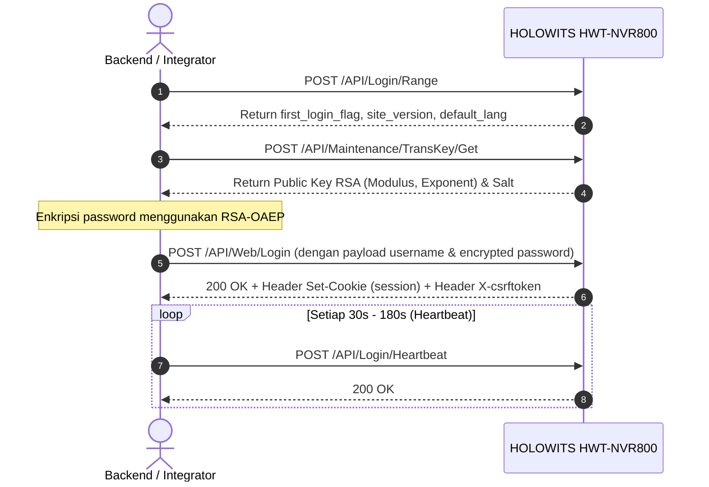
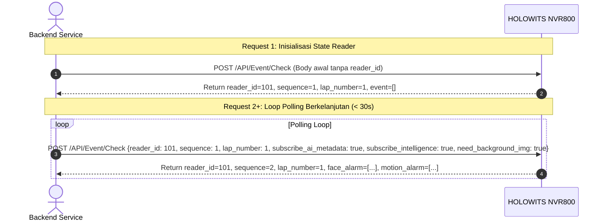

# HOLOWITS HWT-NVR800 9.0.0 API Reference & Integration Master Guide

Dokumen ini merupakan panduan lengkap, terstruktur, dan komprehensif mengenai **REST API HOLOWITS HWT-NVR800 (Firmware V9.0.0)** yang diekstrak dan dirangkum secara mendalam dari dokumen resmi `[Interface Document]HWT-NVR800 9.0.0 API Reference.pdf` (641 Halaman, 18 Bab).

---

## 📌 Peta Bab & Daftar Isi
1. [Overview, Spesifikasi Protokol & Konvensi Request](#1-overview-spesifikasi-protokol--konvensi-request)
2. [Alur Autentikasi, Login, Session & Token](#2-alur-autentikasi-login-session--token)
3. [Daftar Error Code Lengkap (General & Session)](#3-daftar-error-code-lengkap)
4. [Konfigurasi Sistem & Manajemen User (Bab 2)](#4-konfigurasi-sistem--manajemen-user)
5. [Konfigurasi Jaringan, ONVIF, RTSP & GB/T 28181 (Bab 3 & 17)](#5-konfigurasi-jaringan-onvif-rtsp--gbt-28181)
6. [Manajemen Channel & Pengaturan Kamera (Bab 4)](#6-manajemen-channel--pengaturan-kamera)
7. [Video Streaming & Pengambilan URL RTSP (Bab 5)](#7-video-streaming--pengambilan-url-rtsp)
8. [Konfigurasi Alarm & Linkage (Bab 6)](#8-konfigurasi-alarm--linkage)
9. [Manajemen Storage & Harddisk (Bab 7)](#9-manajemen-storage--harddisk)
10. [Rencana & Jadwal Alarm/Perekaman (Bab 8 & 9)](#10-rencana--jadwal-alarmperekaman)
11. [Maintenance, Upgrade & Factory Reset (Bab 10)](#11-maintenance-upgrade--factory-reset)
12. [Pengambilan Snapshot (Bab 12)](#12-pengambilan-snapshot)
13. [PTZ Control & Presets (Bab 13)](#13-ptz-control--presets)
14. [Event & Alarm Push Polling (`/API/Event/Check`) (Bab 14)](#14-event--alarm-push-polling)
15. [AI Target & Face Recognition Services (Bab 15)](#15-ai-target--face-recognition-services)
16. [Konfigurasi Intelligent Services / Video Analytics (Bab 16)](#16-konfigurasi-intelligent-services--video-analytics)
17. [FAQ & Solusi Masalah Integrasi (Bab 18)](#17-faq--solusi-masalah-integrasi)

---

## 1. Overview, Spesifikasi Protokol & Konvensi Request

* **Default Base URL**: `https://<NVR_IP>:443` (atau HTTP `http://<NVR_IP>:80` jika diaktifkan).
* **Format Header Wajib**:
  * `Content-Type: application/json; charset=UTF-8`
  * `Accept: application/json, text/javascript, */*; q=0.01`
  * `Cookie: session=<session_id>` *(setelah login)*
  * `X-csrftoken: <csrf_token>` *(setelah login)*
* **Metode HTTP**: Hampir seluruh endpoint menggunakan **POST**.
* **Klasifikasi Endpoint**:
  * **Range API** (`.../Range`): Mendapatkan rentang nilai, opsi valid, dan kapabilitas channel/fitur (maks. 64 item/request).
  * **Get API** (`.../Get`): Mengambil konfigurasi / data status terkini (maks. 64 item/request).
  * **Set API** (`.../Set`): Menyimpan perubahan konfigurasi (maks. 10 item/request untuk mencegah beban berlebih).
* **Struktur Body Request Umum**:
```json
{
  "version": "1.0",
  "data": {
    /* Parameter spesifik API */
  }
}
```

---

## 2. Alur Autentikasi, Login, Session & Token

HOLOWITS NVR800 menggunakan mekanisme autentikasi bertahap menggunakan enkripsi RSA-OAEP atau token sesi:



### 2.1 Cek Info Status Login Awal
* **URL**: `/API/Login/Range`
* **Method**: `POST`
* **Response Output**:
  * `first_login_flag` (bool): Jika `true`, NVR baru dinyalakan pertama kali dan perlu inisialisasi password admin melalui `/API/FirstLogin/Password/Set`.
  * `site_version` (string): Versi firmware (misal `"9.0.0"`).
  * `lang_strs` (array): Daftar bahasa yang didukung.

### 2.2 Ambil Kunci Enkripsi Transmisi
* **URL**: `/API/Maintenance/TransKey/Get` *(atau `/API/Login/TransKey/Get` untuk pre-login)*
* **Method**: `POST`
* **Response**: Berisi Public Key RSA untuk mengenkripsi password dengan padding `RSA_PKCS1_OAEP_PADDING`.

### 2.3 Login Web / API
* **URL**: `/API/Web/Login` *(opsional query: `?YYYY-MM-DD%20hh:mm:ss`)*
* **Method**: `POST`
* **Body Request**:
```json
{
  "version": "1.0",
  "data": {
    "username": "admin",
    "password": "<RSA_ENCRYPTED_BASE64_STRING>",
    "client_type": "web"
  }
}
```
* **Response Headers**:
  * `Set-Cookie: session=xxxxxx; HttpOnly; path=/`
  * `X-csrftoken: yyyyyy`
  *(Simpan kedua nilai ini untuk disematkan di setiap request selanjutnya).*

### 2.4 Heartbeat (Keep-Alive Sesi)
* **URL**: `/API/Login/Heartbeat`
* **Method**: `POST`
* **Body**: `{"version": "1.0", "data": {}}`

### 2.5 Token Login (Direct Web Embed)
Jika ingin menyematkan web UI NVR ke iframe atau aplikasi web pihak ketiga tanpa popup login manual:
1. Dapatkan Token: `POST /API/Get_Login_Token`
2. URL Akses: `http://<NVR_IP>/?login_token=<TOKEN>&page=<PAGE>&lg=ENU`
   * Opsi `page`: `live` (Live preview), `playback` (Pemutaran rekaman), `config` (Konfigurasi).

### 2.6 Logout
* **URL**: `/API/Web/Logout`
* **Method**: `POST`

---

## 3. Daftar Error Code Lengkap

### Error Umum (General Error Codes)
| Error Code | Deskripsi / Penyebab |
| :--- | :--- |
| `param_error` | Parameter input tidak sesuai skema atau tidak valid |
| `no_permission` | Pengguna tidak memiliki hak akses |
| `first_login` | Wajib ganti password saat login pertama kali |
| `part_failed` | Gagal menyimpan sebagian konfigurasi channel |
| `no_support` | Fitur tidak didukung oleh tipe hardware/firmware ini |
| `frequent_operation` | Frekuensi request melebihi ambang batas aman |
| `token_invalid` / `token_generation_failed` | Token otorisasi tidak valid atau gagal digenerate |
| `device_busy` | NVR sedang mencapai batas pemrosesan request maksimal |
| `user_locked_login` | Akun terkunci sementara (gagal login > 5 kali, lock 3 menit) |
| `user_expired_login` | Akun pengguna telah kadaluarsa |

### Error Terkait Sesi (Session Error Codes)
| Error Code | Deskripsi / Penyebab |
| :--- | :--- |
| `no_login` | Belum login atau session header tidak dikirimkan |
| `expired` | Sesi login sudah habis masa berlakunya |
| `one_IE` | Satu sesi browser hanya dapat digunakan oleh satu login aktif |
| `logout` | Sesi telah keluar / di-logout |
| `login_at_other` | Akun telah login dari komputer / lokasi lain |
| `device_reboot` | Perangkat NVR baru saja direstart |
| `param_changed` | Parameter pengguna telah dimodifikasi |

---

## 4. Konfigurasi Sistem & Manajemen User (Bab 2)

* **Basic System Parameters**:
  * Get: `/API/SystemConfig/General/Get`
  * Set: `/API/SystemConfig/General/Set`
* **Waktu & NTP**:
  * System Time: `/API/SystemConfig/Time/Get` & `/Set`
  * NTP Server: `/API/SystemConfig/Ntp/Get` & `/Set`
  * DST (Daylight Saving Time): `/API/SystemConfig/Dst/Get` & `/Set`
* **Local Output (HDMI / VGA Display)**:
  * Get: `/API/SystemConfig/LocalOutput/Get`
  * Set: `/API/SystemConfig/LocalOutput/Set`
* **Manajemen Pengguna (User Management)**:
  * Get Users: `/API/SystemConfig/User/Get`
  * Set/Add/Modify User: `/API/SystemConfig/User/Set`
  * Backup Password Config: `/API/SystemConfig/BackupPassword/Get` & `/Set`
* **Status Sistem & Informasi Versi**:
  * System Info: `/API/SystemConfig/SystemInfo/Get`
  * Network State: `/API/SystemConfig/NetworkState/Get`
  * Channel Summary Info: `/API/SystemConfig/ChannelInfo/Get`

---

## 5. Konfigurasi Jaringan, ONVIF, RTSP & GB/T 28181 (Bab 3 & 17)

* **Network Basics (IP, Subnet, Gateway, DNS)**:
  * Range: `/API/NetworkConfig/Basic/Range`
  * Get: `/API/NetworkConfig/Basic/Get`
  * Set: `/API/NetworkConfig/Basic/Set`
  * Ping / Network Test: `/API/NetworkConfig/Test/Set`
* **IP Filtering / Firewall**:
  * Get: `/API/NetworkConfig/NetRestrict/Get`
  * Set: `/API/NetworkConfig/NetRestrict/Set`
* **HTTPS & Certificate Management**:
  * HTTPS Param: `/API/NetworkConfig/Https/Get` & `/Set`
  * Certificate Token & Upload: `/API/Login/CertFile/Token` & `/API/Login/CertFile/Get`
* **ONVIF Service (Integrasi Kamera Pihak Ketiga)**:
  * Get: `/API/NetworkConfig/Onvif/Get`
  * Set: `/API/NetworkConfig/Onvif/Set`
* **RTSP Service Settings**:
  * Get: `/API/NetworkConfig/Rtsp/Get`
  * Set: `/API/NetworkConfig/Rtsp/Set`
* **GB/T 28181 Platform Protocol**:
  * Get: `/API/NetworkConfig/GB28181/Get`
  * Set: `/API/NetworkConfig/GB28181/Set`
* **Email & FTP Notification / Snapshot Upload**:
  * Email Config: `/API/NetworkConfig/Email/Get` & `/Set` (Test: `/API/NetworkConfig/EmailTest/Set`)
  * FTP Config: `/API/NetworkConfig/Ftp/Get` & `/Set` (Test: `/API/NetworkConfig/FtpTest/Set`)
* **Discovery Kamera via Broadcast (Bab 17)**:
  * Scan Kamera LAN: `/API/ChannelConfig/RemoteDev/Search`

---

## 6. Manajemen Channel & Pengaturan Kamera (Bab 4)

* **Manajemen IP Camera**:
  * Get Channel List: `/API/ChannelConfig/IPChannel/Get`
  * Tambah/Edit Kamera: `/API/ChannelConfig/IPChannel/Set` dengan `"operation_type": "AddOrEditChannel"`
  * Hapus Kamera: `/API/ChannelConfig/IPChannel/Set` dengan parameter `remove_ipc`
  * Protocol Management: `/API/ChannelConfig/ProtocolManage/Get` & `/Set`
* **OSD (On-Screen Display / Text Overlay)**:
  * Get: `/API/ChannelConfig/OSD/Get`
  * Set: `/API/ChannelConfig/OSD/Set` (Mengatur nama channel, format waktu, teks kustom)
* **Image Control & Kualitas Video**:
  * Get: `/API/ChannelConfig/ImageControl/Get`
  * Set: `/API/ChannelConfig/ImageControl/Set`
  * Default Reset: `/API/ChannelConfig/ImageControl/Default`
  * Pengaturan Warna (Brightness, Contrast, Saturation, Hue): `/API/ChannelConfig/VideoColor/Get` & `/Set`
* **Privacy Mask (Video Cover)**:
  * Get: `/API/ChannelConfig/CoverArea/Get`
  * Set: `/API/ChannelConfig/CoverArea/Set`

---

## 7. Video Streaming & Pengambilan URL RTSP (Bab 5)

### 7.1 Mendapatkan URL RTSP Live Streaming
* **URL**: `/API/Preview/GetRtspUrl/Get`
* **Method**: `POST`
* **Body Request**:
```json
{
  "version": "1.0",
  "data": {
    "channel": ["CH1"],
    "transport_type": "tcp",
    "is_device": false,
    "is_dualtalk": false,
    "is_metadata": false
  }
}
```
* **Response Output**:
```json
{
  "result": "success",
  "data": {
    "channel_info": [
      {
        "channel": "CH1",
        "main_stream": "rtsp://<NVR_IP>:554/LiveStream/CH1/main?token=xxxx",
        "sub_stream": "rtsp://<NVR_IP>:554/LiveStream/CH1/sub?token=xxxx"
      }
    ]
  }
}
```

### 7.2 Konfigurasi Parameter Stream (Bitrate, Resolusi, FPS)
* **Main Stream**:
  * Get: `/API/StreamConfig/MainStream/Get`
  * Set: `/API/StreamConfig/MainStream/Set`
* **Sub Stream**:
  * Get: `/API/StreamConfig/SubStream/Get`
  * Set: `/API/StreamConfig/SubStream/Set`

---

## 8. Konfigurasi Alarm & Linkage (Bab 6)

* **Motion Detection (Deteksi Gerak)**:
  * Get: `/API/AlarmConfig/Motion/Get`
  * Set: `/API/AlarmConfig/Motion/Set`
  * Range: `/API/AlarmConfig/Motion/Range`
* **Physical I/O Alarm**:
  * Get: `/API/AlarmConfig/IO/Get`
  * Set: `/API/AlarmConfig/IO/Set`
* **Exception Alarm (Disk Penuh, IP Conflict, Network Error)**:
  * Get: `/API/AlarmConfig/Exception/Get`
  * Set: `/API/AlarmConfig/Exception/Set`
* **Alarm Linkage (Aksi saat Alarm Trigger)**:
  * PTZ Linkage: `/API/AlarmConfig/PTZLinkage/Get` & `/Set`
  * Audio/Buzzer Linkage: `/API/AlarmConfig/AudioLinkage/Get` & `/Add` & `/Clear`

---

## 9. Manajemen Storage & Harddisk (Bab 7)

* **Status Hard Disk**:
  * Get Disk Info: `/API/StorageConfig/Disk/Get`
  * Set Disk (Overwrites, Mode): `/API/StorageConfig/Disk/Set`
  * Disk Grouping: `/API/StorageConfig/DiskGroup/Get`
* **Format Disk**:
  * Execute Format: `/API/StorageConfig/Disk/Format`
  * Progress Format: `/API/StorageConfig/Disk/Format/Progress`
* **Shared Cloud Storage**:
  * Get/Set/Unbind: `/API/StorageConfig/SharedCloud/Get`, `/Set`, `/Unbind`

---

## 10. Rencana & Jadwal Alarm/Perekaman (Bab 8 & 9)

* **Jadwal Alarm (Plan Configuration)**:
  * Get Plan: `/API/PlanConfig/Plan/Get`
  * Set Plan: `/API/PlanConfig/Plan/Set`
* **Recording Settings**:
  * Basic Recording Setup: `/API/RecordingConfig/Basic/Get` & `/Set`
  * Recording Schedule (Normal, Alarm, Motion): `/API/RecordingConfig/Schedule/Get` & `/Set`
* **Playback & Unduh Rekaman**:
  * Cari Rekaman: `/API/Playback/RecordFile/Search`
  * Ambil Daftar Hasil: `/API/Playback/RecordFile/Get`
  * URL RTSP Playback: `/API/Playback/PlaybacRtspkUrl/Get`
  * Download File Rekaman: `/API/Playback/RecordFile/Download`

---

## 11. Maintenance, Upgrade & Factory Reset (Bab 10)

* **Reboot Perangkat**:
  * Reboot NVR: `/API/Maintenance/DeviceReboot/Set`
  * Auto Reboot Schedule: `/API/Maintenance/AutoReboot/Get` & `/Set`
  * Reboot Remote IPC: `/API/IPCMaintaint/IPCReboot/Set`
* **Restore Factory Settings**:
  * Get Reset Options: `/API/Maintenance/Reset/Get`
  * Execute Reset: `/API/Maintenance/Reset/Set`
* **System Firmware Upgrade**:
  * Request Token: `/API/Maintenance/SystemUpgrade/Token`
  * Upgrade Firmware: `/API/Maintenance/SystemUpgrade/Upgrade`
  * Cloud Upgrade Check & Execute: `/API/Maintenance/CloudUpgrade/Check` & `/Upgrade` & `/Progress`
* **System Log Export**:
  * Set/Export Log: `/API/Maintenance/Log/Set`

---

## 12. Pengambilan Snapshot (Bab 12)

### 12.1 Realtime Snapshot (Format Base64)
Mengambil gambar terkini tanpa menyimpannya ke HDD NVR.
* **URL**: `/API/Snapshot/Get`
* **Method**: `POST`
* **Body Request**:
```json
{
  "version": "1.0",
  "data": {
    "channel": "CH1",
    "snapshot_resolution": "1920 x 1080"
  }
}
```
* **Response**:
```json
{
  "result": "success",
  "data": {
    "channel": "CH1",
    "date": "08/20/2026",
    "time": "10:30:00",
    "img_data": "/9j/4AAQSkZJRgABAQAAAQABAAD..."
  }
}
```

### 12.2 Server Snapshot (Simpan ke Hard Disk NVR)
* **URL**: `/API/ManualSnapshot/Capture`
* **Method**: `POST`
* **Body Request**: `{"version": "1.0", "data": {"channel": "CH1"}}`

---

## 13. PTZ Control & Presets (Bab 13)

* **URL Kontrol**: `/API/PreviewChannel/PTZ/Control`
* **Method**: `POST`

### Tabel Kode Perintah PTZ (`cmd`):
| cmd | Nama Konstanta | Fungsi |
| :---: | :--- | :--- |
| `1` | `PTZ_CMD_UP` | Pan Up |
| `2` | `PTZ_CMD_DOWN` | Pan Down |
| `3` | `PTZ_CMD_LEFT` | Pan Left |
| `4` | `PTZ_CMD_RIGHT` | Pan Right |
| `5` | `PTZ_CMD_UPLEFT` | Up-Left |
| `6` | `PTZ_CMD_UPRIGHT` | Up-Right |
| `7` | `PTZ_CMD_DOWNLEFT` | Down-Left |
| `8` | `PTZ_CMD_DOWNRIGHT` | Down-Right |
| `9` | `PTZ_CMD_ZOOMIN` | Zoom In |
| `10` | `PTZ_CMD_ZOOMOUT` | Zoom Out |
| `11` | `PTZ_CMD_FOCUSNEAR`| Focus Near |
| `12` | `PTZ_CMD_FOCUSFAR` | Focus Far |
| `13` | `PTZ_CMD_IRISOPEN` | Buka Aperture |
| `14` | `PTZ_CMD_IRISCLOSE`| Tutup Aperture |
| `15` | `PTZ_CMD_AUTOSCAN` | Auto Horizontal Scan |
| `16` | `PTZ_CMD_CRUISE` | Jalankan Patroli Preset |
| `18` | `PTZ_CMD_SETPRESET` | Tambah / Simpan Titik Preset |
| `19` | `PTZ_CMD_CLEARPRESET`| Hapus Titik Preset |
| `20` | `PTZ_CMD_CALLPRESET` | Panggil Titik Preset |
| `52` | `PTZ_FAST_LOCATE` | 3D Positioning (Box Drag) |

### Contoh Request Gerakan PTZ:
```json
{
  "version": "1.0",
  "data": {
    "channel": "CH1",
    "cmd": 3,
    "speed": 5,
    "ctl_stop": false
  }
}
```
*(Untuk menghentikan gerakan motor, kirim ulang request dengan `"ctl_stop": true`)*

---

## 14. Event & Alarm Push Polling (Bab 14)

NVR800 menggunakan arsitektur **Stateful Long Polling** via `/API/Event/Check`.



### Format Request Polling:
* **URL**: `/API/Event/Check`
* **Method**: `POST`
* **Body Request**:
```json
{
  "version": "1.0",
  "data": {
    "reader_id": 101,
    "sequence": 1,
    "lap_number": 1,
    "subscribe_ai_metadata": true,
    "subscribe_intelligence": true,
    "need_background_img": true
  }
}
```
* **Kategori Alarm yang Dilaporkan**:
  * `motion_alarm`: Deteksi gerakan per channel
  * `videoloss_alarm`: Sinyal video terputus
  * `io_alarm`: Trigger port alarm hardware
  * `face_alarm`: Deteksi wajah, kemiripan database, crop image & background
  * `behavior_alarm`: Pelanggaran batas garis/area
  * `vehicle_alarm`: Tangkapan pelat nomor & tipe kendaraan

---

## 15. AI Target & Face Recognition Services (Bab 15)

### 15.1 Manajemen Target List (Face Group)
* **Tambah Grup**: `/API/AI/FDGroup/Add`
* **Modifikasi Grup**: `/API/AI/FDGroup/Modify`
* **Hapus Grup**: `/API/AI/FDGroup/Remove`
* **Lihat Daftar Grup**: `/API/AI/FDGroup/Get`

### 15.2 Manajemen Data Target / Wajah
* **Tambah Wajah**: `/API/AI/Faces/Add` (Payload: Image Base64, Nama, Identitas, Group ID)
* **Modifikasi Wajah**: `/API/AI/Faces/Modify`
* **Hapus Wajah**: `/API/AI/Faces/Remove`
* **Pindah Grup**: `/API/AI/FDGroup/Change`
* **Query Database Target**:
  1. `/API/AI/AddedFaces/Search` (Ambil total jumlah data)
  2. `/API/AI/AddedFaces/GetByIndex` (Paginasi)
  3. `/API/AI/AddedFaces/GetById` (Detail spesifik ID)

### 15.3 Query Target Snapshots (Hasil Deteksi Kamera)
* **Hitung Jumlah Snapshot**: `/API/AI/SnapedFaces/Search`
* **Paginasi Snapshot**: `/API/AI/SnapedFaces/GetByIndex`
* **Detail Snapshot by ID**: `/API/AI/SnapedFaces/GetById`
* **Stop Query**: `/API/AI/SnapedFaces/StopSearch`

### 15.4 Face Match & Feature Extraction
* **Ekstraksi Fitur Foto**: `/API/AI/ImagesFeature/Get`
* **Pencocokan Wajah 1:N**: `/API/AI/CompareFaces/Add` & `/API/AI/MatchGroupFaces/Get`

### 15.5 Smart Analytics & Statistik
* **Head Counting (Penghitung Orang)**: `/API/AI/CCStatistics/Search`
* **Heat Map Statistics**: `/API/AI/HeatMapStatistics/Search`
* **Customer Flow Analysis**: `/API/AI/FaceCustomerStatistics/Get`
* **Realtime Regular Customer**: `/API/AI/RealtimeRepeaters/Search` & `/Get`
* **Object Classification Search**: `/API/AI/SnapedObjects/Search` & `/GetByIndex`

---

## 16. Konfigurasi Intelligent Services / Video Analytics (Bab 16)

Konfigurasi parameter analitik video pintar di setiap channel kamera:
* **Kapabilitas Intelligent Channel**: `/API/Intelligent/CameraCapability/Get`
* **Tripwire & Perimeter Area Intrusion**:
  * Line Crossing: `/API/Intelligent/PerimeterLine/Get` & `/Set`
  * Zone Intrusion: `/API/Intelligent/PerimeterZone/Get` & `/Set`
  * Fast Movement / Running: `/API/Intelligent/FastMovement/Get` & `/Set`
  * Area Enter / Exit: `/API/Intelligent/AreaEnter/Get` & `/API/Intelligent/AreaExit/Get`
* **Target Capture (Face Capture Setup)**:
  * Get: `/API/Intelligent/PerimeterFace/Get`
  * Set: `/API/Intelligent/PerimeterFace/Set`
* **Deteksi Gangguan Kamera & Khusus**:
  * Lens Blocking (Kamera Ditutup): `/API/Intelligent/LensCover/Get` & `/Set`
  * Mask Detection (Deteksi Masker): `/API/Intelligent/MaskDetect/Get` & `/Set`
  * Audio Exception Diagnosis: `/API/Intelligent/AudioDetect/Get` & `/Set`
  * Queue Length Detection (Panjang Antrean): `/API/Intelligent/QueueDetect/Get` & `/Set`
  * Crowd Density Detection (Kepadatan Kerumunan): `/API/Intelligent/CrowdDensity/Get` & `/Set`
  * Abandoned / Removed Object Detection: `/API/Intelligent/AbandonedObject/Get` & `/API/Intelligent/RemovedObject/Get`
  * Parking Violation & Electric Bike Detection: `/API/Intelligent/ParkingViolation/Get`, `/API/Intelligent/ElectricBike/Get`
  * Off-Duty Detection (Petugas Tinggalkan Pos): `/API/Intelligent/OffDuty/Get` & `/Set`

---

## 17. FAQ & Solusi Masalah Integrasi (Bab 18)

### Q1: Mengapa request API dari Browser Frontend terhalang error CORS?
> **Jawaban**: Embedded web server pada NVR800 menerapkan kebijakan Same-Origin Policy tanpa header `Access-Control-Allow-Origin: *`.
> **Solusi**: Seluruh integrasi API wajib dilakukan melalui **Backend Gateway / Proxy** (seperti Laravel, Node.js Express, atau FastAPI) yang meneruskan request ke IP NVR.

### Q2: Mengapa `/API/Event/Check` tidak mengirimkan notifikasi alarm setelah request pertama?
> **Jawaban**: Pada request pertama, NVR mengembalikan nilai koordinat pointer `reader_id`, `sequence`, dan `lap_number`. Nilai-nilai ini **wajib disertakan** kembali pada body JSON request kedua dan seterusnya. Request polling berikutnya harus dikirimkan dalam interval **< 30 detik** agar `reader_id` tidak kadaluarsa.

### Q3: Bagaimana cara memutar RTSP stream di web browser HTML5?
> **Jawaban**: Web browser modern tidak mendukung RTSP secara native. Gunakan RTSP Media Gateway (seperti **go2rtc**, **MediaMTX**, atau **FFmpeg RTSP to WebRTC/HLS/WSS-FLV**) untuk mengonversi stream dari NVR ke browser.

---

*Dokumen ini merupakan referensi resmi integrasi lengkap HOLOWITS HWT-NVR800 9.0.0.*
